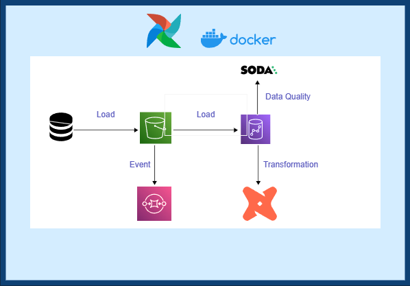
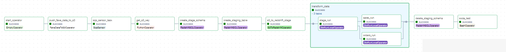

# Data Modeling with Airflow Data Pipeline Project

This project showcases an Airflow-based data pipeline designed for loading and processing data from a table into a Redshift data warehouse. The pipeline consists of two DAGs: one for the initial load and another for incremental load.

## Project Overview
The project involves the following components and technologies:

- Airflow for workflow orchestration (using astro)
- Kaggle dataset for initial load
- Redshift as the data warehouse
- Amazon S3 as the staging area
- dbt (data build tool) for data transformation
- Soda for data quality monitoring
- Faker library for incremental load data generation

The data modeling follows a typical star schema approach, with facts and dimensions.

## Tools and Technologies

- Cloud - AWS
- Containerization - Docker
- Orchestration - Airflow
- Transformation - dbt
- Data Lake - S3
- Data Warehouse - Redshift
- Data Quality - Soda
- Queue Service - SQS
- CI/CD - Github Actions
- Language - Python, SQL

## Architecture



## DAGs

### Initial Load DAG

The Initial Load DAG is responsible for the initial data load from a Kaggle dataset into Redshift. It comprises the following tasks:

1. Loading the local file onto the s3 bucket
2. Creating schema for staging and public in redhsift
3. Load the data from s3 to redhsift staging
4. Perform transformations in staging using dbt and load to public. dbt models mateiralized as tables to create new tables.
5. Delete staging schema
   


### Incremental Load DAG

The Incremental Load DAG is responsible for incremental data load using the data logically generated using Faker library.

1. Generates fake data and pushes it to an S3 bucket
2. Waits for a message in the SQS queue and retrieves the S3 key from the SQS message of the latest file uploaded in the bucket
3. Create staging schema
4. Load the data from s3 to redhsift staging
5. staged data undergoes incremental transformations using dbt.
6. Delete staging schema
7. Data quality checks are performed using SODA to ensure the integrity and accuracy of the loaded data.



## Getting Started

1. Clone the repository:

   ```bash
   git clone https://github.com/JawaharRamis/Data-Modelling-Redshift-Dbt--Airflow.git
   ```

2. Navigate to the project directory:

   ```bash
   cd Data-Modelling-Redshift-Dbt--Airflow
   ```
3. Create a `.env` file with following environment variables.
   - AWS_ACCESS_KEY
   - AWS_SECRET_KEY
   - SQS_URL - Url of the SQS queue
   - S3_BUCKET - S3 bucket name
   - S3_INITIAL_LOAD_KEY - Initial load key name
   - DATABASE_USERNAME - redshift username
   - DATABASE_PASSWORD - redshift username
   - REDSHIFT_HOST - redshift host address
  
4. Create S3 bucket with name S3_BUCKET.

5.  Trigger SQS Queue on S3 file upload

6. Configure Redshift(serverless in my instance) and allow access.

7. Run the astro project
   ```bash
   astro dev start
   ```
8. Access airflow UI

9. Trigger initial load dag once and switch off  once done

10. Trigger incremental load dag
    
## How can I make this better?

- Implement CI/CD
- Utilizing Infrastructure as code
- Dashboard and Analysis
- Managaed Infra for Airflow
